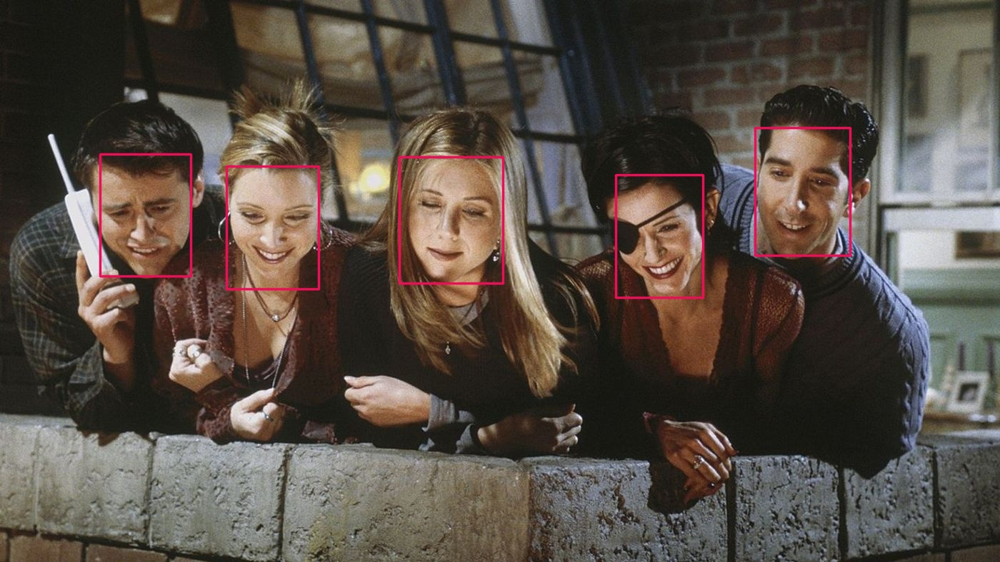

# FastFace: Lightweight Face Detection Framework


[](https://fastface.readthedocs.io/en/latest/?badge=latest)
[](https://pepy.tech/project/fastface)


**Easy-to-use face detection framework, developed using [pytorch-lightning](https://www.pytorchlightning.ai/).**<br>
**Checkout [documentation](https://fastface.readthedocs.io/en/latest/) for more.**

## Key Features
* :fire: **Use pretrained models for inference with just few lines of code**
* :chart_with_upwards_trend: **Evaluate models on different datasets**
* :hammer_and_wrench: **Train and prototype new models, using pre-defined architectures**
* :rocket: **Export trained models with ease, to use in production**

## Contents
- [Installation](#installation)
- [Pretrained Models](#pretrained-models)
- [Demo](#demo)
- [Benchmarks](#benchmarks)
- [Tutorials](#tutorials)
- [References](#references)
- [Citations](#citations)

## Installation
From PyPI
```
pip install fastface -U
```

From source
```
git clone https://github.com/borhanMorphy/light-face-detection.git
cd light-face-detection
pip install .
```

## Pretrained Models
Pretrained models can be accessable via `fastface.FaceDetector.from_pretrained(<name>)`

Name|Architecture|Configuration|Parameters|Model Size|Link
:------:|:------:|:------:|:------:|:------:|:------:
**lffd_original**|lffd|original|2.3M|9mb|[weights](https://drive.google.com/file/d/1qFRuGhzoMWrW9WNlWw9jHXPY51MBssQD/view?usp=sharing)
**lffd_slim**|lffd|slim|1.5M|6mb|[weights](https://drive.google.com/file/d/1UOHllYp5NY4mV7lHmq0c9xsryRIufpAQ/view?usp=sharing)

## Demo
Using package
```python
import fastface as ff
import imageio

# load image as RGB
img = imageio.imread("<your_image_file_path>")[:,:,:3]

# build model with pretrained weights
model = ff.FaceDetector.from_pretrained("lffd_original")
# model: pl.LightningModule

# get model summary
model.summarize()

# set model to eval mode
model.eval()

# [optional] move model to gpu
model.to("cuda")

# model inference
preds, = model.predict(img, det_threshold=.8, iou_threshold=.4)
# preds: {
#    'boxes': [[xmin, ymin, xmax, ymax], ...],
#    'scores':[<float>, ...]
# }

```

Using [demo.py](/demo.py) script
```
python demo.py --model lffd_original --device cuda --input <your_image_file_path>
```
sample output;


## Benchmarks
**Following results are obtained with this repository**

#### WIDER FACE
validation set results

Name|Easy|Medium|Hard|
:------:|:------:|:------:|:------:
**lffd_original**|**0.893**|**0.866**|**0.758**
**lffd_slim**|**0.866**|**0.854**|**0.742**


## Tutorials
* [Widerface Benchmark](./tutorials/widerface_benchmark/README.md)
* [BentoML Deployment](./tutorials/bentoml_deployment/README.md)

## References
- [LFFD Paper](https://arxiv.org/pdf/1904.10633.pdf)
- [Official LFFD Implementation](https://github.com/YonghaoHe/A-Light-and-Fast-Face-Detector-for-Edge-Devices)

## Citations
```bibtex
@inproceedings{LFFD,
    title={LFFD: A Light and Fast Face Detector for Edge Devices},
    author={He, Yonghao and Xu, Dezhong and Wu, Lifang and Jian, Meng and Xiang, Shiming and Pan, Chunhong},
    booktitle={arXiv:1904.10633},
    year={2019}
}
```
