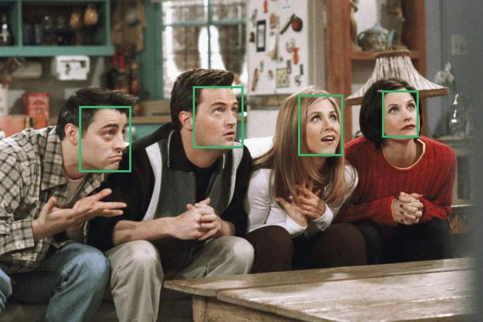

# FastFace BentoML Deployment
**[BentoML](https://www.bentoml.ai/) is a model serving framework, enabling to deliver prediction services in a fast, repeatable and scalable way.<br>**

**This tutorial will explain how to export [fastface]((https://github.com/borhanMorphy/light-face-detection)) models as [ONNX](https://onnx.ai/) and deploy to bentoml prediction service.**

## Installation
**install latest fastface and bentoml via pip**
```
pip install fastface==0.1.3 BentoML==0.12.1 -U
```

## BentoService Definition
define BentoService as [service.py](./service.py)  
```python
from bentoml import env, artifacts, api, BentoService
from bentoml.adapters import ImageInput
from bentoml.frameworks.onnx import OnnxModelArtifact

import numpy as np
from typing import List, Dict

@env(infer_pip_packages=True)
@artifacts([
    OnnxModelArtifact('model', backend="onnxruntime")
])
class FaceDetectionService(BentoService):

    def prepare_input(self, img: np.ndarray) -> np.ndarray:
        img = np.transpose(img[:, :, :3], (2, 0, 1))
        return np.expand_dims(img, axis=0).astype(np.float32)

    def to_json(self, results: np.ndarray) -> Dict:
        # results: (N, 6) as x1,y1,x2,y2,score,batch_idx
        return {
            "boxes": results[:, :4].astype(np.int32).tolist(),
            "scores": results[:, 4].astype(np.float32).tolist()
        }

    @api(input=ImageInput(), batch=True, mb_max_batch_size=8, mb_max_latency=1000)
    def detect(self, imgs: List[np.ndarray]):
        input_name = self.artifacts.model.get_inputs()[0].name
        preds = []
        for img in imgs:
            results = self.artifacts.model.run(None, {input_name: self.prepare_input(img) })[0]
            preds.append(
                self.to_json(results)
            )
        return preds
```

## Build And Pack BentoService
define operations as [build.py](./build.py)
```python
# import fastface package to get pretrained model
import fastface as ff
import torch
import tempfile

# pretrained model
pretrained_model_name = "lffd_original"

# get pretrained model
model = ff.FaceDetector.from_pretrained(pretrained_model_name)

# export as onnx
opset_version = 11

dynamic_axes = {
    "input_data": {0: "batch", 2: "height", 3: "width"}, # write axis names
    "preds": {0: "batch"}
}

input_names = [
    "input_data"
]

output_names = [
    "preds"
]

# define dummy sample
input_sample = torch.rand(1, *model.arch.input_shape[1:])

# export model as onnx
with tempfile.NamedTemporaryFile(suffix='.onnx', delete=True) as tmpfile:
    model.to_onnx(tmpfile.name,
        input_sample=input_sample,
        opset_version=opset_version,
        input_names=input_names,
        output_names=output_names,
        dynamic_axes=dynamic_axes,
        export_params=True
    )

    # get FaceDetectionService
    from service import FaceDetectionService

    # create FaceDetectionService instance
    face_detection_service = FaceDetectionService()

    # Pack the model artifact
    face_detection_service.pack('model', tmpfile.name)

# Save the service to disk for model serving
saved_path = face_detection_service.save(version="v{}".format(ff.__version__))

print("saved path: {}".format(saved_path))
```

run `build.py` with the following
```
python build.py
```

## Serving The Model In Production Mode

To serve model in production mode run the following (model will be served from http://0.0.0.0:5000).
```
bentoml serve-gunicorn FaceDetectionService:latest -w 1
```

## Test Rest API

test rest api with [test.py](./test.py)
```python
import requests
from fastface.utils.vis import render_predictions
import imageio

url = "http://localhost:5000/detect"

payload={}
files=[
  ('image',('friends2.jpg',open('../../resources/friends2.jpg','rb'),'image/jpeg'))
]
headers = {}

response = requests.request("POST", url, headers=headers, data=payload, files=files)

print(response.json())

pretty_img = render_predictions(imageio.imread('../../resources/friends2.jpg'), response.json())

# show image
pretty_img.show()
```

Output should look like this<br>




## Build And Deploy Using Docker
BentoML also provides docker support for distributing services.<br>

Run following to build docker image
```
docker build --tag face-detection-service $HOME/bentoml/repository/FaceDetectionService/v0.1.3/
```

After docker image build is done, run docker container with the following
```
docker run -p 5000:5000 -e BENTOML__APISERVER__DEFAULT_GUNICORN_WORKER_COUNTS=1 --name face_detection_service face-detection-service
```