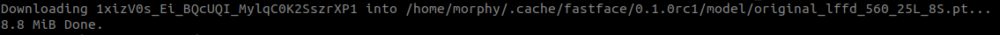
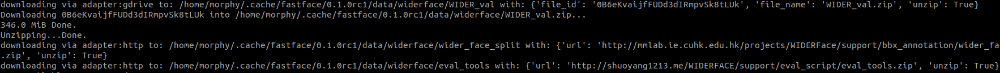
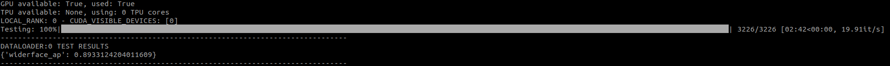

# Widerface Benchmark Tutorial

## Setup
Install latest version of `fastface` with
```
pip install fastface -U
```

## Discovery
`fastface` is packed with varius pretrained models, to see full list run the following
```
python -c "import fastface as ff;print(ff.list_pretrained_models())"
```
Output will be look like
```
['original_lffd_560_25L_8S', 'original_lffd_320_20L_5S']
```

## Start

Lets import required packages
```python
import fastface as ff
import pytorch_lightning as pl
import torch
```

Build pretrained model. For this tutorial `original_lffd_560_25L_8S` is selected but you can also select another model
```python
model = ff.module.from_pretrained("original_lffd_560_25L_8S")
# model: pl.LightningModule
```

If you don't have pretrained model weights in your PC, `fastface` will automatically download and put it under `$HOME/.cache/fastface/<package_version>/model/`



Add widerface average precision(defined in the widerface competition) metric to the model
```python
metric = ff.metric.WiderFaceAP(iou_threshold=0.5)
# metric: pl.metrics.Metric

# add metric to the model
model.add_metric("widerface_ap",metric)
```

Define widerface datamodule. For this tutorial `easy` partition is selected but `medium` or `hard` partitions are also available<br>
`Warning!` Do not use `batch_size` > 1, because tensors can not be stacked due to different size of images. Also using fixed image size drops metric performance.
```python
dm = ff.datamodule.WiderFaceDataModule(
    partitions=["easy"],
    test_kwargs={
        'batch_size':1,
        'num_workers':2
    },
    test_transforms= ff.transform.Compose(
        ff.transform.Normalize(mean=127.5, std=127.5),
        ff.transform.ToTensor()
    )
)
# dm: pl.LightningDataModule
```

Setup datamodule with the following<br>

```python
# download data if needed
dm.prepare_data(stage='test')

# setup test dataloader
dm.setup(stage='test')
```

If you don't have widerface validation dataset in your PC, `fastface` will automatically download and put it under `$HOME/.cache/fastface/<package_version>/data/widerface/`



Define `pytorch_lightning.Trainer`
```python
trainer = pl.Trainer(
    logger=False,
    checkpoint_callback=False,
    gpus=1 if torch.cuda.is_available() == 'cuda' else 0,
    precision=32)
```

Run test
```python
trainer.test(model, datamodule=dm)
```

You should get output like this after test is done



Checkout [test_widerface.py](./test_widerface.py) script to see full code
